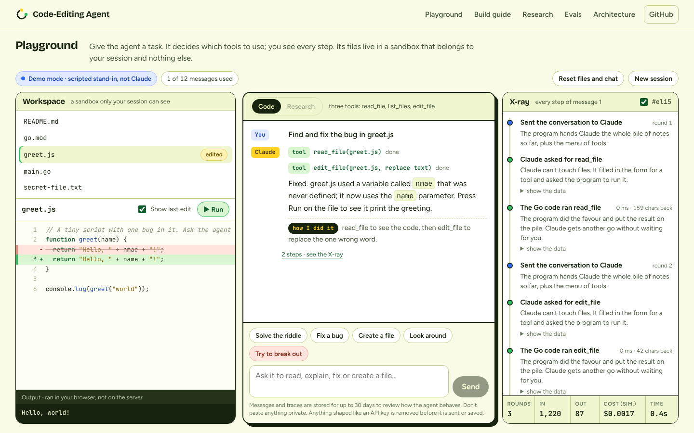
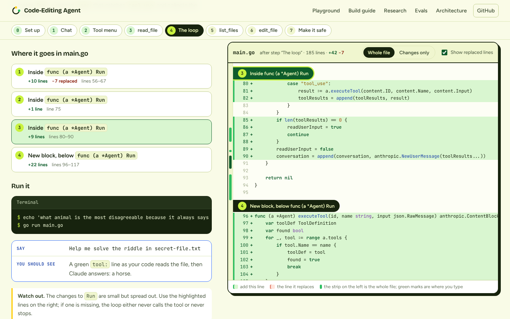

# Code-Editing Agent

An LLM, a loop, and three tools: a working code-editing agent in Go, taken
from a ~300-line tutorial file to something strangers can be allowed to use.

**Live:** <https://code.aurimas.io> · [Playground](https://code.aurimas.io/playground) · [Build guide](https://code.aurimas.io/guide) · [Evals](https://code.aurimas.io/evals) · [Architecture](https://code.aurimas.io/architecture)



## What this is

The core follows Thorsten Ball's
[How to Build an Agent](https://ampcode.com/notes/how-to-build-an-agent): send
the conversation to Claude, run the tools it asks for, send the results back,
repeat. That loop is about forty lines and it has not changed.

Everything else here is what the loop needs before it can face the internet:

- **A sandbox.** Tools work on a workspace they cannot leave: an in-memory
  file tree per visitor on the web, an `os.Root` directory in the terminal.
- **Safer edits.** Two inputs that silently damaged files in the tutorial
  version are refused.
- **Limits.** Rounds, tokens, time, messages per session and per visitor, and
  a daily budget in dollars that survives restarts.
- **A trace of every step,** streamed to the browser and stored in Supabase.
- **Web research** as a fourth tool, with sources, published only after a
  person reviews the answer.
- **Evals** that run on every commit, and a live-model suite.
- **A website** with a playground, and a build guide that shows the whole of
  `main.go` after every step and says in words where each new line goes.

## Try it in a minute, with no API key

```bash
git clone https://github.com/aurimas13/Code-Editing-Agent
cd Code-Editing-Agent
make dev          # API on :8080, website on :3000
```

Open <http://localhost:3000/playground>. With no `ANTHROPIC_API_KEY` set, the
server runs in **demo mode**: a small scripted stand-in answers in place of
Claude, driving the real tools through the real loop. The page says so.

In the terminal:

```bash
make cli          # chats in /tmp/agent-workspace; asks before every edit
```

Needs Go 1.24+ and Node 22+.

## With the real model

```bash
export ANTHROPIC_API_KEY=...
make dev
```

To persist sessions and traces, also set `SUPABASE_URL` and
`SUPABASE_SECRET_KEY` (see `.env.example`). To deploy, see
[docs/DEPLOY.md](docs/DEPLOY.md).

## The build guide



`guide/steps/` holds six checkpoints, each a complete program: the agent as
it stands after that step. Steps 1 to 5 are generated from the finished file,
so they cannot drift, and CI compiles all six. The website reads those same
files, diffs each against the one before, and labels every change with where
it sits: "Inside `func main`", "New block, below `func (a *Agent) Run`".

Run any checkpoint directly:

```bash
go run ./guide/steps/04-tool-loop
```

## What changed from the tutorial

| | Tutorial `main.go` | This repository | Evidence |
| --- | --- | --- | --- |
| File access | Any path the model names | Validated, then confined to a sandbox | `evals/01`, `TestDiskFSConfinement` |
| `edit_file`, empty search text on an existing file | Inserts the new text between every character | Refused | `edit-empty-old-str-on-existing-file` |
| `edit_file`, text that appears more than once | Replaces every match | Refused; asks for more context | `edit-ambiguous-match` |
| Malformed tool input | `panic` in `list_files` | Error returned to the model | `input-wrong-type` |
| Stopping | Never, while the model wants tools | Round limit; last round must be text | `round-limit-stops-a-runaway` |
| Cost | 16,000 output tokens, no accounting | Caps at four levels and a daily budget | `TestDailyBudgetStopsModelCalls` |
| Secrets in files | Sent to the model | Redacted first | `credential-in-file-never-reaches-model` |
| Observability | `fmt.Printf` | One event per step: streamed, stored, tested | `TestTurnEmitsEventsInOrder` |
| Tests | None | Unit, integration, three eval suites | below |

The first four rows are not assumptions about the tutorial code.
`guide/steps/06-edit-file/baseline_test.go` runs against it, unchanged, and
passes, pinning each behaviour.

## Layout

```
cmd/agent            terminal chat (the tutorial experience, on the new packages)
cmd/server           HTTP API for the website
cmd/evals            eval runner
cmd/gen              exports checkpoints, prompt, tools and limits to the website
internal/agent       the loop, events, system prompt
internal/tools       read_file, list_files, edit_file
internal/workspace   path validation; in-memory and os.Root filesystems
internal/guardrails  input checks, redaction, rate limits, budget
internal/llm         model client; fakellm, a wire-level fake of the Messages API
internal/store       Supabase (REST) and in-memory persistence
internal/server      sessions, limits, SSE streaming
internal/evals       eval harness
guide/steps          the six tutorial checkpoints
evals/               eval suites (JSON) and the latest report
supabase/migrations  schema, row level security, retention
web/                 Next.js site
docs/                deployment, evals, security, decision records
```

## Tests and evals

```bash
make test             # go vet, go test -race, web tests
make evals            # 39 deterministic cases; writes the report the site shows
make evals-live       # plus 15 live-model cases (needs a key, costs cents)
make test-integration # store and access rules against a real Postgres
```

| Suite | Cases | Model | Result in the committed report |
| --- | --- | --- | --- |
| Sandbox and edit rules | 25 | none | 25/25 |
| Agent loop | 14 | scripted fake over the real wire format | 14/14 |
| Live model | 15 | real (`claude-haiku-4-5`) | 15/15 on the last run, 4 October 2026 |

The first two suites run on every commit. The live suite costs a few cents
and is run on demand; the report keeps its last result with the date, model
and commit it ran at, and drops it as soon as a case changes. One run is one
sample, not a guarantee. How the suites work and how to add a case:
[docs/EVALS.md](docs/EVALS.md).

### What the first day of live use found

Everything above passed before launch. Then the deployed agent was used by
hand: 24 messages in 7 sessions over 50 minutes, 48 cents in all. That turned
up 13 problems that no suite had caught. Each was traced to its cause in
the stored trace and fixed. The ones that mattered
most:

| What happened | Fix | Where |
| --- | --- | --- |
| A cited answer rendered as broken lines: the API returns one text block per cited span | Join neighbouring text blocks into one passage | code + test |
| Asked to save research, the model wrote `<cite>` tags into the file | Strip citation markup from tool input in research mode | code + test |
| October weather reported as -13 °C from a page cached in winter | Give the model today's date; say what a search snippet can and cannot show | code + prompt |
| Each earlier search added about 8,500 tokens to every later call: a one-line question cost 0.3 cents fresh, 3.5 cents after two searches | Drop search results from the conversation when the turn ends; keep the reply | code + test |
| "Read ../../etc/passwd" declined by the model without calling the tool | Tell the model to always try, so the refusal comes from the sandbox | prompt, second wording |
| "Fix a bug" got a question back | Look at the files before asking | prompt |
| Weather for Liverpool in Fahrenheit | Say how to convert and show the format | prompt, second wording |
| The model agreed at once when a fact was disputed | Search again and compare before changing the answer | prompt, no automated check |
| A weather question in Code mode was sent to a weather app | Tell the code-mode agent about the Research tab | prompt + test |

The full list, with what was asked, what came back, the cause and what now
checks each one, is on the site's
[Evals page](https://code.aurimas.io/evals#live-use) and in
[`web/src/content/fieldnotes.ts`](web/src/content/fieldnotes.ts).

Two things about the evals themselves came out of it:

- **The live suite was wrong twice before the agent was.** Its first two runs
  scored 14 of 15, on two different cases. Both times the agent had done the
  task and the check had named one way of doing it: a FizzBuzz that appends
  "Fizz" then "Buzz" never contains the word "FizzBuzz", and "print only
  until 15" does not require changing the default. The agent's code was the
  same in all three runs; only the checks changed. A live check has to test
  the outcome, not one route to it.
- **Prompt fixes are the weak layer.** Code fixes are covered by tests and by
  the mutation check. Prompt fixes can only be checked against the real
  model; two had to be reworded before the model followed them, one is still
  only partly followed, and three have no automated check because the live
  suite sends one message per case.

## Design decisions

Short records of the choices that shaped this, with the alternatives that
were rejected:

1. [Security comes from what the agent can reach, not from what it is told](docs/adr/0001-capability-over-prompt.md)
2. [An in-memory workspace per visitor instead of containers](docs/adr/0002-in-memory-workspace.md)
3. [Test against a fake API over the wire, not a mocked interface](docs/adr/0003-fake-api-over-the-wire.md)
4. [Talk to Supabase over REST, with no database driver](docs/adr/0004-supabase-over-rest.md)
5. [Heuristic input filters record; they do not block](docs/adr/0005-heuristics-record-not-block.md)

Security model and known gaps: [SECURITY.md](SECURITY.md).

## What this does not do

- Rate limits and live sessions are in one process's memory. More than one
  instance would need those moved to Postgres or Redis. The interfaces are
  shaped for it; the work is not done, and the deployment is pinned to one
  replica.
- Cost is estimated from list prices and reported token counts. It is good
  enough to enforce a budget and is not an invoice.
- The budget is checked before a turn and charged after, so turns running at
  the same moment can overshoot by their own cost.
- Redaction recognises common credential formats, not arbitrary secrets.
- The agent cannot run code. That is a decision
  ([ADR 0002](docs/adr/0002-in-memory-workspace.md)), and it means it cannot
  run tests on what it writes.
- Demo mode is a scripted stand-in that recognises a handful of requests.

## Credits and how this was built

The agent's core is from
[How to Build an Agent](https://ampcode.com/notes/how-to-build-an-agent) by
Thorsten Ball. The checkpoints in `guide/steps` are that tutorial's code, as I
typed it while following along.

The refactor, sandbox, limits, evals and website were built with Claude as a
pair programmer. The decisions and their reasons are in `docs/adr`; the tests
are how I know the result does what it says.

Built by [Aurimas Nausėdas](https://aurimas.io). This is the third agent in a
series, after a
[calculator agent](https://github.com/aurimas13/Calculator-Agent) in Python
and [Claude Agent From Scratch](https://github.com/aurimas13/Claude-Agent-From-Scratch).

## License

[MIT](LICENSE)
